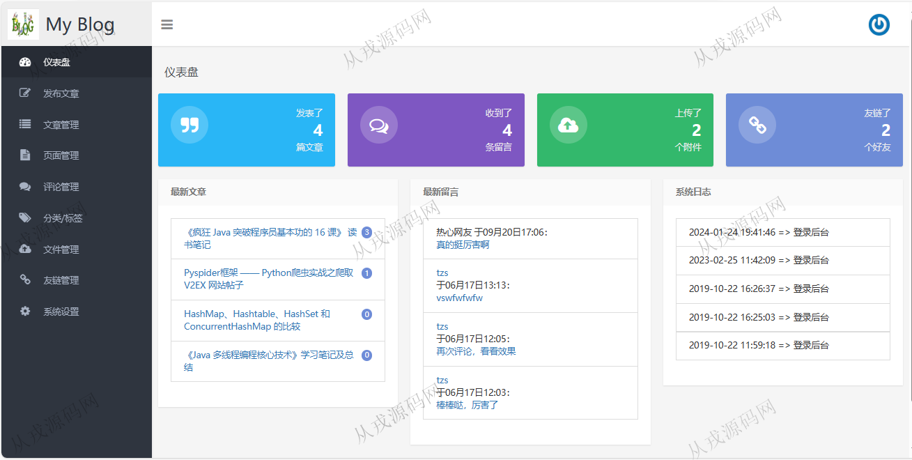
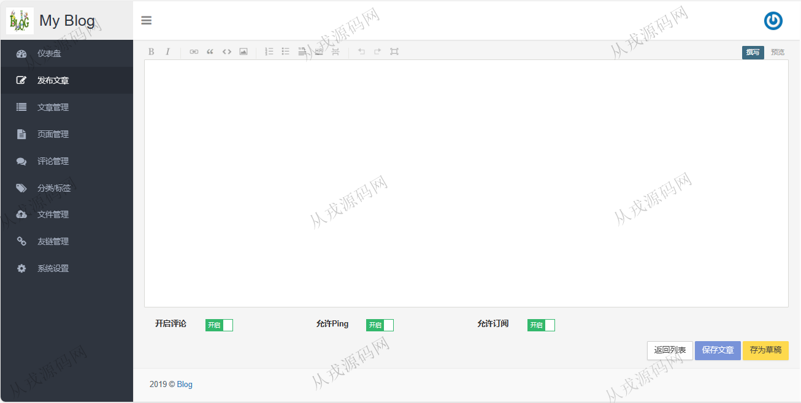
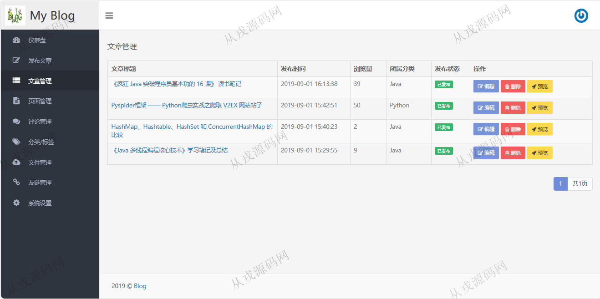
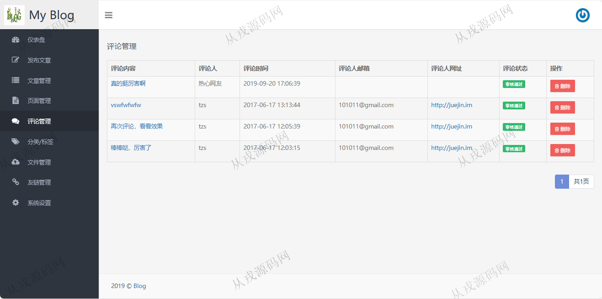
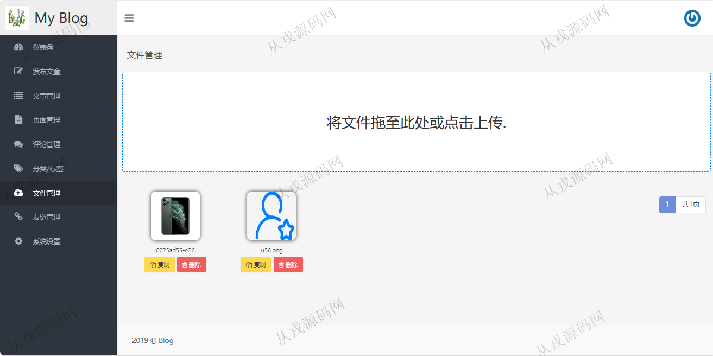
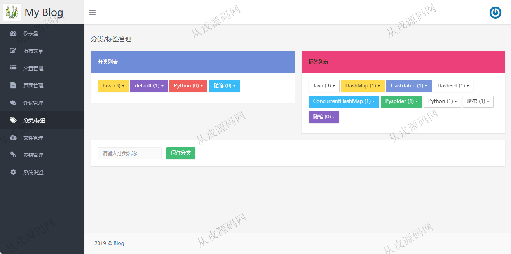
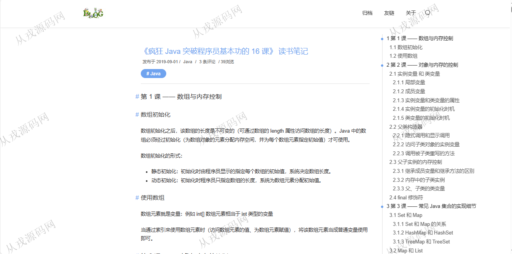
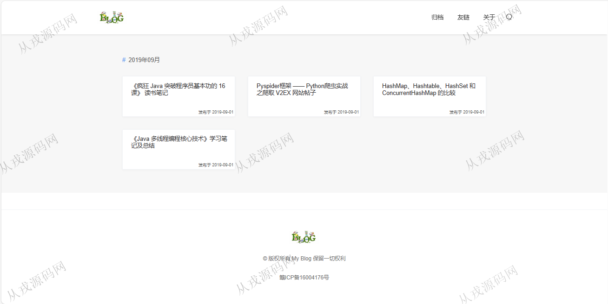

<h1 align="center">221.个人博客管理系统</h1>

- <b>完整代码获取地址：从戎源码网 ([https://armycodes.com/](https://armycodes.com/))</b>
- <b>技术探讨、资料分享，请加QQ群：692619798</b> 
- <b>作者微信：19941326836  QQ：952045282</b> 
- <b>承接计算机毕业设计、Java毕业设计、Python毕业设计、深度学习、机器学习</b>
- <b>选题+开题报告+任务书+程序定制+安装调试+论文+答辩ppt 一条龙服务</b>
- <b>所有选题地址 ([https://github.com/YuLin-Coder/AllProjectCatalog](https://github.com/YuLin-Coder/AllProjectCatalog)) </b>

## 项目介绍
基于springboot的个人博客管理系统【含报告】：前端 html、jquery、bootstrap，后端 maven、springmvc、spring、mybatis；角色分为管理员、用户；集成文章管理、评论管理、分类管理、文件管理等功能于一体的系统。

## 功能介绍

- 仪表盘：发表文章数、收到了留言数、上传附件数，友链好友数，最新文章、最新留言、系统日志
- 文章管理：文章的增删改查，文章预览，存为草稿，开启评论
- 页面管理：页面信息的增删改查，页面预览
- 评论管理：评论信息列表查询，评论审核，评论删除
- 分类标签管理：分类信息的增删改查，标签信息的增删改查
- 文件管理：文件信息列表查询，文件上传，文件复制，文件删除
- 友链管理：友链信息的增删改查
- 系统设置：全局设置，个性化设置，系统备份

## 环境

- <b>IntelliJ IDEA 2021.3</b>

- <b>Mysql 5.7.26</b>

- <b>JDK 1.8</b>

## 运行截图

